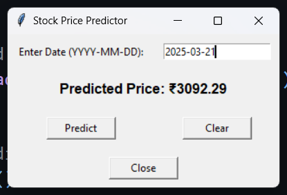
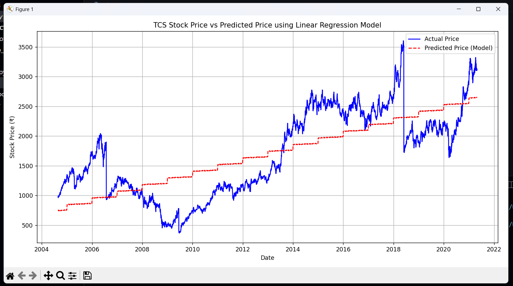

# 📈 Stock Price Predictor Based on Date (TCS)

Welcome to the **Stock Price Predictor**, a simple yet effective machine learning project that predicts the **TCS stock price** based solely on a given **date**. This project demonstrates the integration of data preprocessing, linear regression modeling, and a user-friendly GUI built with `Tkinter`.

---

## 🎥 Demonstration


---

## 🖼 Snapshots

### 📌 GUI Preview


### 📌 Graph Visualization


---

## 🧠 Project Overview

### 🔧 Problem Statement
Predict the stock price of **TCS** for a user-given date using historical data and basic date features.

### 📁 Dataset
- **Source:** `TCS_stock_price.csv`
- **Columns Used:** `Date`, `Close`
- **Features Engineered:** `Day`, `Month`, `Year`, `DayOfWeek`

---

## 🧰 Tech Stack

- **Language:** Python
- **Libraries:** 
  - `pandas`, `scikit-learn`, `joblib`
  - `matplotlib` (for visualization)
  - `tkinter` (for GUI)

---

## 🧑‍💻 How it Works

### 🏗 Model Training (`model.py`)
- Converts the `Date` into multiple features (day, month, year, day of week).
- Uses a **Linear Regression** model (scalable to Random Forest).
- Saves the trained pipeline using `joblib`.

### 🖼 GUI Interface (`gui.py`)
- Accepts a date in `YYYY-MM-DD` format.
- Loads the saved model.
- Predicts the stock price and displays it dynamically.
- Includes input validation and error handling.

### 📊 Visualization (`plot.py`)
- Loads the dataset and trained model.
- Compares **actual** vs **predicted** stock prices using line plots.

---

## 🚀 Getting Started

### 1. Clone this repository

```bash
git clone https://github.com/your-repo/stock-price-predictor.git
cd stock-price-predictor
